# Introduction
This is a simple RESTful api. It is suggested to use visual studio code to test the project, as the following are implemented using vscode as IDE.

# Run
Make sure you have already downloads certain packages and familiar with asp.net.

Run the following following command in the terminal.
```
cd TodoApi
dotnet watch
```
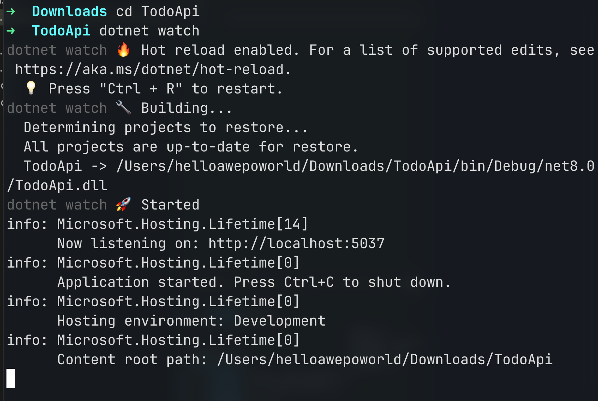
Compliation start! The browser automatically open to connect local server. ie: `http://localhost:{POST}/`.
Since the project uses `Postman` to illustrate, we just need the URL for further use.

## Setup Postman
- download postman in the [official website](https://www.postman.com/downloads/).
- open postman
- click `Workspaces` (next to HOME) and enter `my workspaces`
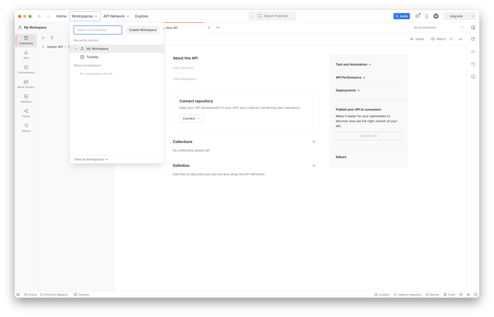
- click `new` to create a new workspcaes called `simple api`
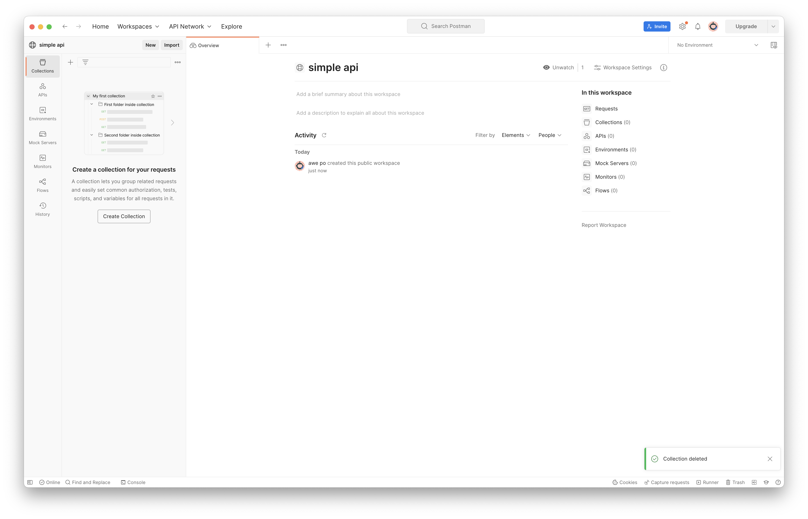
- create a new `collection` and click `add a request`
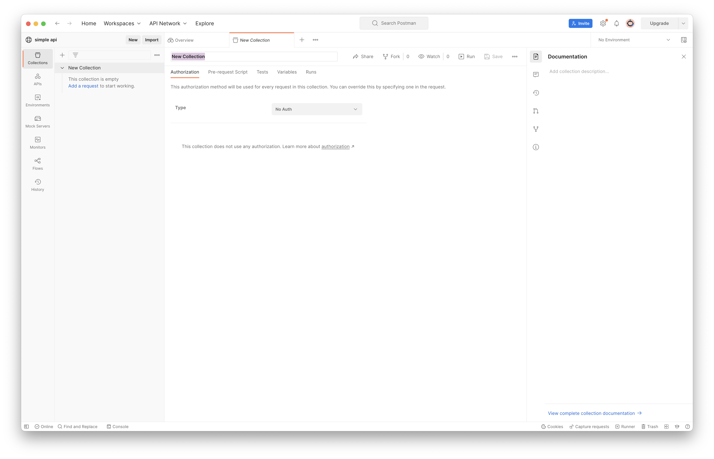
- enter the URL (aforementioned in the last sentence of (Run)[#run]) in the block
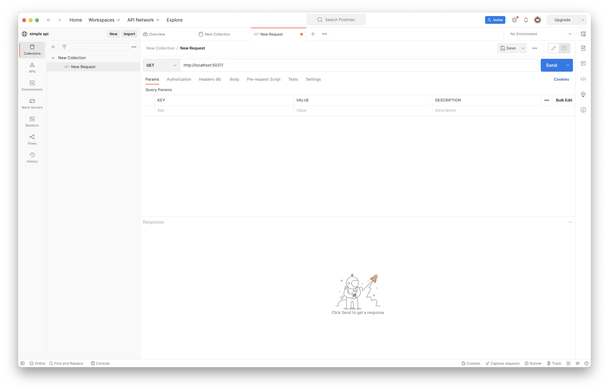
- the most important step! add `todoitems` after the URL!!! ie: `http://localhost:5037/todoitems`
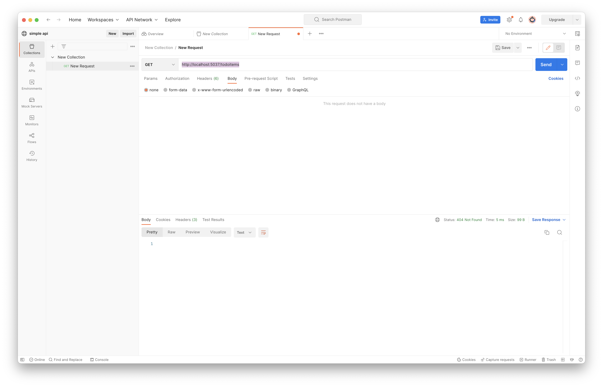

# Start Testing 
## Get and Post

- click `send` button, and it returns status 200 OK but empty in the block, since there are no contents input!
- switch to `post`, choose `body`, `raw` and `Json` format for input
- input, for example, 
```json
{
    "id": 1,
    "Name": "Anton",
    "isComplete": true
}
```
the preceded format can be altered in `Todo.cs` file
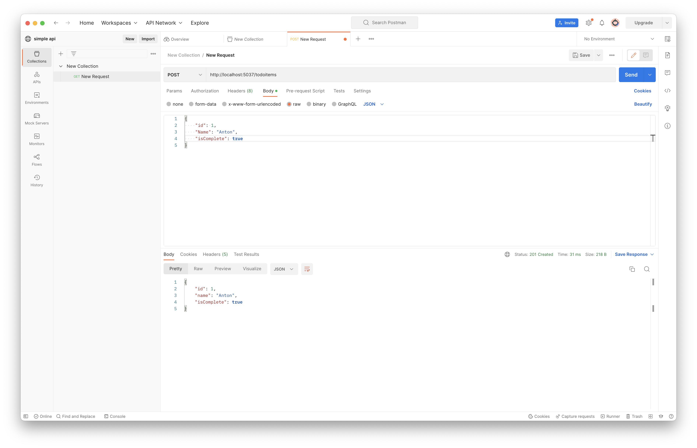

- it returns status 201 Created means successfully create a todo-items
- keep `post` other items, for example,
```json
[
    {
        "id": 2,
        "Name": "Alan",
        "isComplete": true
    }
    {
        "id": 3,
        "Name": "Sam",
        "isComplete": false
    }
    {
        "id": 4,
        "Name": "LOL",
        "isComplete": false
    }
] 
```
NOTE: these items must be inserted one by one followed the above format.


- switch back to `Get`, press `send` button, it returns these items and status 200 OK as desired
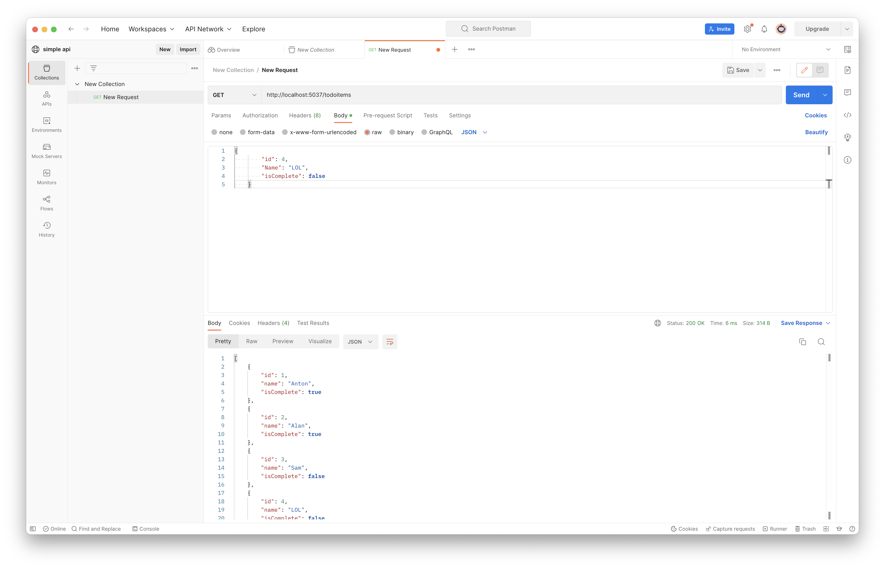

- we can filter to check `isComplete = true`, switch to `get`, change the URL to `http://localhost:5037/todoitems/complete` and press `send` button. Only two objects appear! D
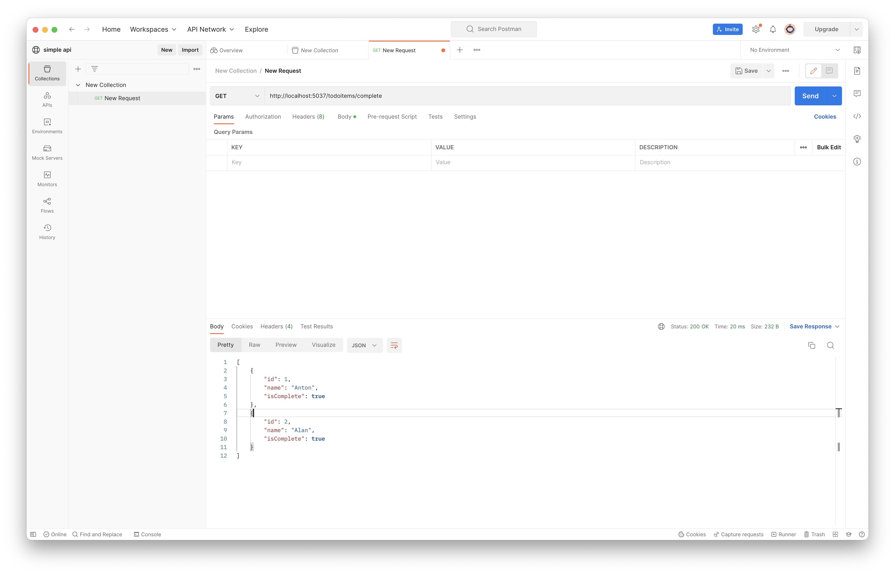

## Put
- we want to change the (4th)-items with id = 4, into 
```json
{
        "id": 4,
        "Name": "Anson",
        "isComplete": true
}
```
- switch to `put` , change the URL to `http://localhost:5037/todoitems/4`, where `4` indicates id = 4
- paste the content into body and press `send` button
- it returns status 200 OK as desired
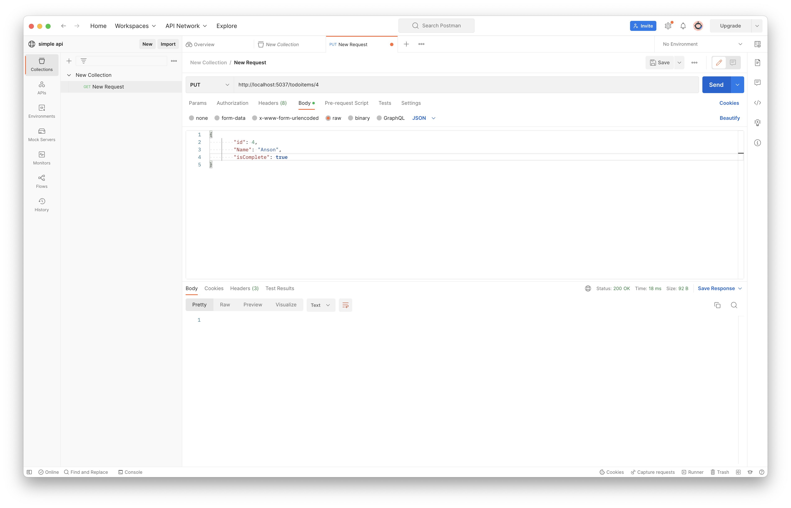
- now check the content. change the URL back to `http://localhost:5037/todoitems`, and switch to `get`, press `send` button
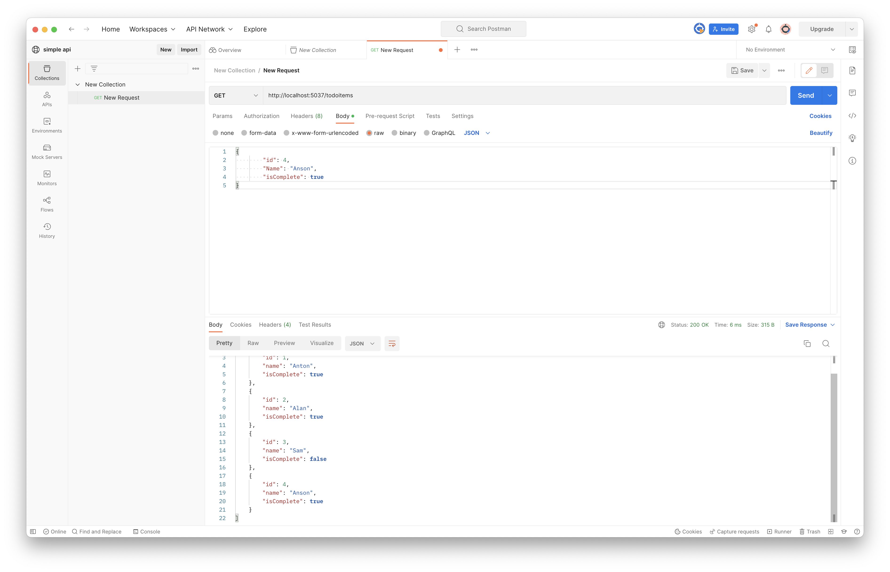
- the content is changed as desired!

## Delete
- we want to delete the object with id = 3
- switch to `delete`, change the URL to `http://localhost:5037/todoitems/3` and press `send` button
- it returns status 200 OK
- now we check it, change the URL back to `http://localhost:5037/todoitems` and press `send` button
- all three objects appear as desired!
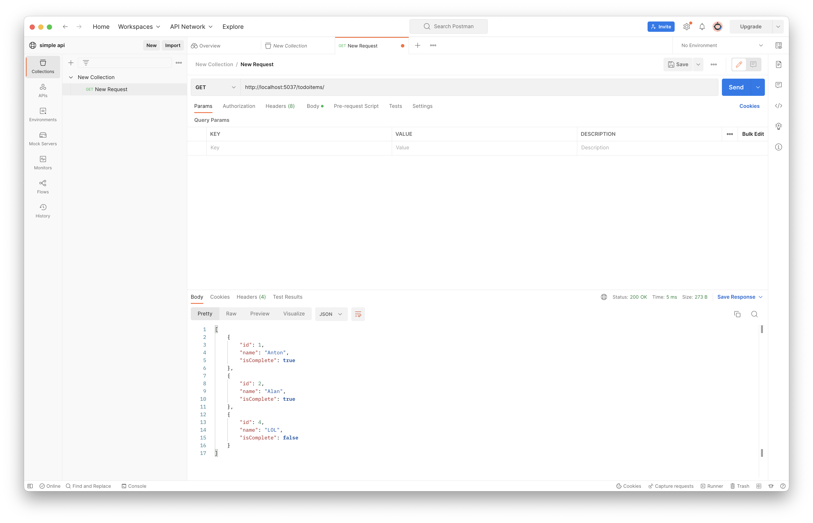

# Database
- The project connects to `sqlite` which is a database that generally install in each computer. 
- to check if it exists in this project, go to terminal
- stop the project by typing `^C` which differ from operating systems
- open the project again and try to test by using the `get`, `post` ...... etc. to see whether the data that was input just now exists or not.
- NOTE: you might need to use command line to immigrant the database to local computer, please see [material](https://learn.microsoft.com/en-us/training/modules/build-web-api-minimal-database/5-exercise-use-sqlite-database) for more detailed! The following commands are recommended to input into terminal if the project folder doesn't have a file called `TodoDb.db` in your local pc
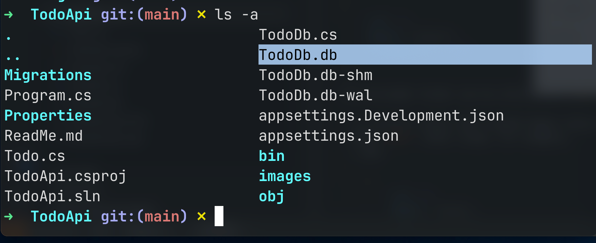

# Reference
[database](https://learn.microsoft.com/en-us/training/modules/build-web-api-minimal-database/5-exercise-use-sqlite-database)
[minimal API with ASP.NET Core](https://learn.microsoft.com/en-us/aspnet/core/tutorials/min-web-api?view=aspnetcore-8.0&tabs=visual-studio-code)
