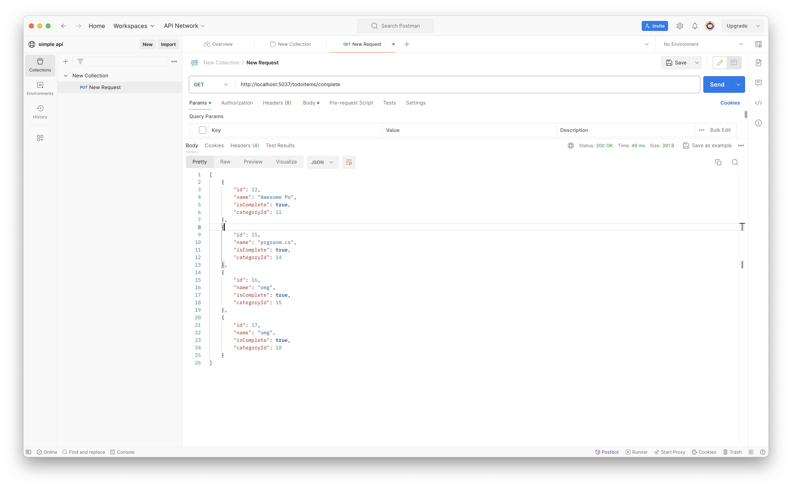
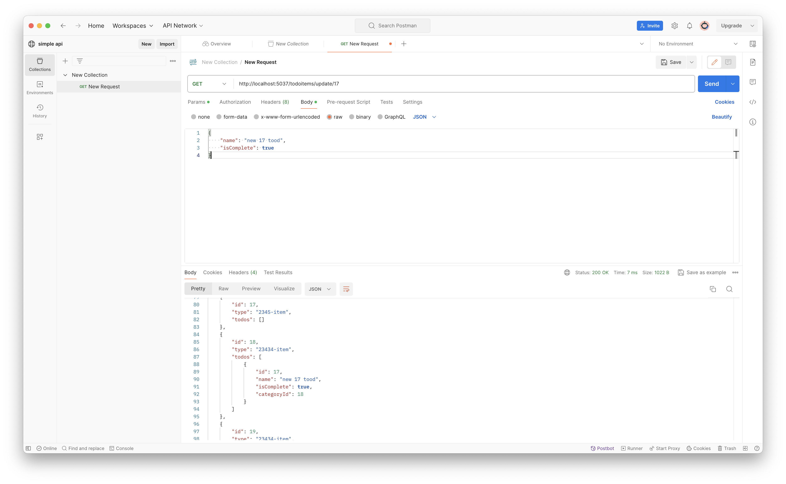

# Introduction
This is a RESTful api v2. The following are implemented using vscode as IDE, which differentiate from commands line such as install packages.
[check previous version](../v1/TodoApi)

# Run
Make sure you have already downloads certain packages and familiar with asp.net, Including
```
dotnet add package Microsoft.EntityFrameworkCore
dotnet add package AutoMapper.Extensions.Microsoft.DependencyInjection
dotnet add package Microsoft.AspNetCore.Mvc.NewtonsoftJson
dotnet add package Microsoft.EntityFrameworkCore.Design
dotnet add package Microsoft.EntityFrameworkCore.sqlite
```
NOTE: package `Microsoft.EntityFrameworkCore.InMemory` is not necessary even though install in the project.

Run the following following command in the terminal.
```
cd TodoApi
dotnet watch
```

Compilation start! The browser automatically open to connect local server. ie: `http://localhost:{POST}/`.
Since the project uses `Postman` to illustrate, we just need the URL for further use.

## Setup Postman
- download postman in the [official website](https://www.postman.com/downloads/).
- open postman
- click `Workspaces` (next to HOME) and enter `my workspaces`

- click `new` to create a new workspcaes called `simple api`

- create a new `collection` and click `add a request`

- enter the URL (aforementioned in the last sentence of (Run)[#run]) in the block

- the most important step! add `todoitems` after the URL!!! ie: `http://localhost:5037/todoitems`


# Start Testing 
## Post 

- switch to `post`, choose `body`, `raw` and `Json` format for input
- input format, for example,
```json
{
  "type": string,
  "todos": [
    {
        "name": string,
        "isComplete": bool
    }
  ]
}
```


- it returns status 201 Created means successfully create a Category
- keep `post` other items, for example,
```json
[
    {
        "type": "task1",
        "todos": [
            {
                "name": "Awesome Po",
                "isComplete": true,
            }
        ]
    },
    {
        "type": "task2",
        "todos": [
            {
                "name": "fist",
                "isComplete": false,
            }
        ]
    },
    {
        "type": "task3",
        "todos": [
            {
                "name": "lol",
                "isComplete": false,
            }
        ]
    },
    {
        "type": "hello",
        "todos": [
            {
                "name": "prgraom.cs",
                "isComplete": true,
            }
        ]
    },
    {
        "type": "todo-item",
        "todos": [
            {
                "name": "omg",
                "isComplete": true,
            }
        ]
    },
    {
        "type": "2345-item",
        "todos": []
    },
    {
        "type": "2345-item",
        "todos": []
    },
    {
        "type": "23434-item",
        "todos": [
            {
                "name": "omg",
                "isComplete": true,
            }
        ]
    },
    {
        "type": "23434-item",
        "todos": []
    },
    {
        "type": "23434-item",
        "todos": []
    }
]
```
NOTE: these items must be inserted one by one followed the above format.
NOTE: todos items can be empty

## Get
Get mode allow user to see the data in the database 

### All data
switch back to `Get`, press `send` button, it returns these items and status 200 OK as desired


### Selected Category
See the selected id category (without todos)
In Get mode, with URL `http://localhost:5037/todoitems/11` (category id)


### All the Information in Selected Category
See the selected id category with todos info.
In Get mode, with URL `http://localhost:5037/todoitems/all/11` (add `all` in front of category id)


### Completed Todos
How to see allow the completed todos?

we can filter to check `isComplete = true`, switch to `get`, change the URL to `http://localhost:5037/todoitems/complete` and press `send` button! 


### All Todos
It is offered to see all the todos at a glance!
In Get mode, with URL `http://localhost:5037/todoitems/todos` (`todos` at the end of URL)


### Selected Todo
See the selected id todo 
In get mode, with URL `http://localhost:5037/todoitems/todo/12` (todo id at the end of `todo`)


## Put
### Insert Todo
We want to insert a new todo into a initialized category
In Put mode, URL `http://localhost:5037/todoitems/create/12` (`create` and `category id`)

check updated database


### Update Todo
we want to change the (17th)-todo with id = 17
In Put mode, URL `http://localhost:5037/todoitems/update/17` (`update` and `todo id`)
```json
{
    "name": "new 17 tood",
    "isComplete": true
}
```
check updated database


### Update Category
we want to change the `id`-th category, ie: id = 11
In Put mode, URL `http://localhost:5037/todoitems/11` (only require `category id`)
```json
{
    "type": "11th task"
}
```


## Delete
### Delete Todo
we want to delete the `id`-th todo, ie: id = 19
In Delete mode, URL `http://localhost:5037/todoitems/todo/19`


### Delete Category
we want to delete the `id`-th category (include all todos), ie: id = 12
In Delete mode, URL `http://localhost:5037/todoitems/12`


# Database
- The project connects to `sqlite` which is a database that generally install in each computer. 
- to check if it exists in this project, go to terminal
- stop the project by typing `^C` which differ from operating systems
- open the project again and try to test by using the `get`, `post` ...... etc. to see whether the data that was input just now exists or not.
- NOTE: you might need to use command line to immigrant the database to local computer, please see [material](https://learn.microsoft.com/en-us/training/modules/build-web-api-minimal-database/5-exercise-use-sqlite-database) for more detailed! The following commands are recommended to input into terminal if the project folder doesn't have a file called `TodoDb.db` in your local pc


# Reference
[database](https://learn.microsoft.com/en-us/training/modules/build-web-api-minimal-database/5-exercise-use-sqlite-database) <br />
[minimal API](https://learn.microsoft.com/en-us/aspnet/core/tutorials/min-web-api?view=aspnetcore-8.0&tabs=visual-studio-code) <br />
[multiple schema](https://www.youtube.com/watch?v=Fp5tSiT3J6o) <br />
